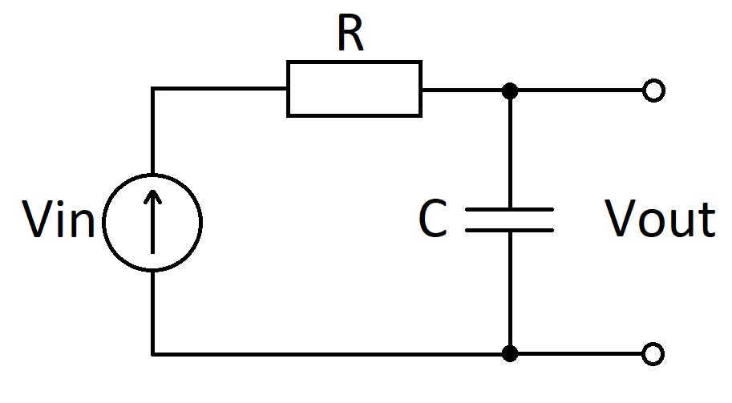

The aim of the project is to consolidate basic knowledge of C programming. 
The essence of the project lies in the simulation of an integrating RC-circuit.  
The integrating RC-circuit smoothes sharp voltage drops. 
The schematic of the RC-circuit is shown in the figure.

The output voltage $V _ { out }$ depends on time $t$ according to the law:

$$
V _ { out } (t) = V _ { 0 } * \( 1 - \exp^\frac { - t } { RC })
$$

The program step by step simulates the increments of charge on the capacitor for a conditional period of time.
The result of the simulation is written to files. When displaying on the screen, the data are read from the files. 
The graph is displayed in the terminal (pseudo-graphics).

Build the program and run it: 
Tested on Mac OS Big Sur, Ubuntu 23. 
To run, go to src, enter make command. GCC is required for compilation.
The executable is available in the src folder. 
To remove temporary files, enter the make clean command.

Program operation:
The program works in interactive mode. 
Pressing the keyboard control buttons changes the simulation parameters.
Switching between input and output signal graphs: 1/2.
Changing the period of the input signal - a/z.
Changing the RC circuit capacitance: s/x.
Change of resistance of RC-chain: d/c.
Exit the program - q. 

If the graphs display mush and chaos, stretch the terminal to the full screen and/or zoom in on the terminal symbols.
